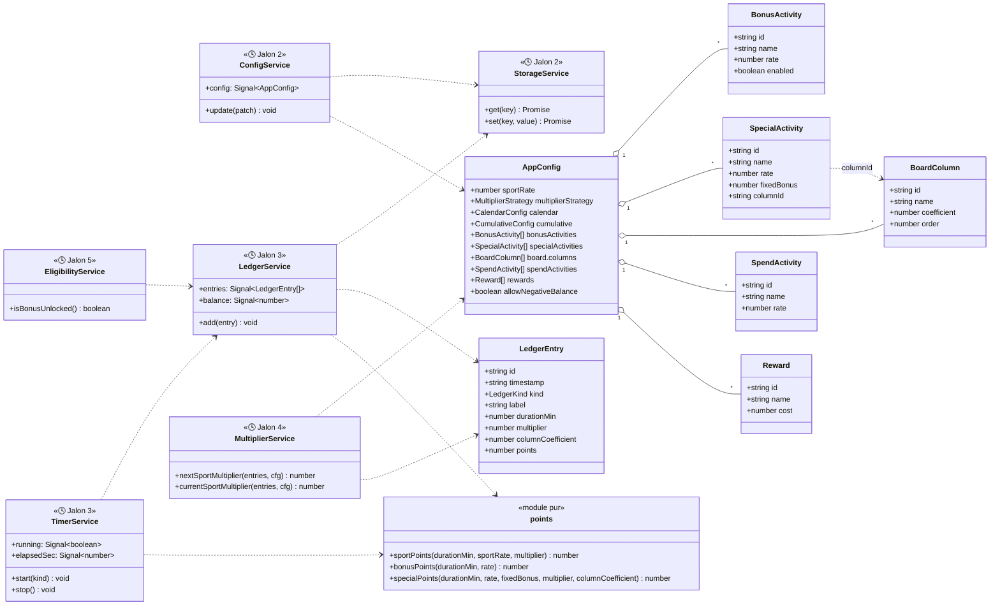

# Architecture — Geek-Fit

Ce document suit l'architecture de l'application au fil des jalons. Le diagramme de classe est
**mis à jour à chaque changement de structure** (nouveau modèle, service, méthode publique, relation).

Légende : ✅ implémenté · 🕓 prévu (jalon indiqué).

## Diagramme de classe



## Navigation (coque Ionic — ✅ Jalon 1)

5 onglets en bas + une page routée pour le tableau (accessible depuis « Gagner ») :

```
/accueil     HomePage      (solde, progression, multiplicateur)
/gagner      EarnPage      (chrono sport, saisie manuelle, bonus, accès tableau)
/depenser    SpendPage     (dépense au temps, récompenses)
/historique  HistoryPage   (journal filtrable)
/reglages    SettingsPage  (paramétrage complet)
```

Bootstrap **standalone** (`bootstrapApplication`) + `provideIonicAngular()` +
`provideRouter()` avec lazy `loadComponent`. État applicatif via **signals** (pas de NgRx).
